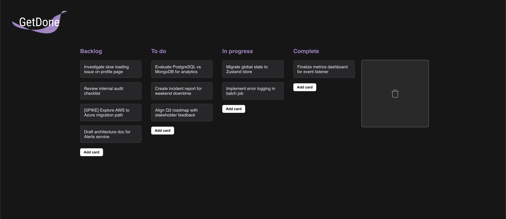

# Kanban Project



This project is a Kanban developed in React, designed to be applied to any type of application. It is fully dynamic and abstracted. 

## Technologies Used

- **React**: JavaScript library for building user interfaces.
- **TypeScript**: A superset of JavaScript that adds static typing.
- **styled-components**: A library for styling components in React.
- **react-router-dom**: A library for routing in React applications.
- **framer-motion**: A library for animations.

## Project Structure

- `src/components`: Contains reusable components such as `CustomModal`.
- `src/pages`: Contains the application pages, such as `HomePage`.
- `src/routes`: Contains the application routes, such as `HomePage`.

## Installation

1. Clone the repository:

   ```bash
   git clone <https://github.com/gabriellazaroni/kanban.git>

   ```

2. Install dependencies:

   ```bash
   npm install

   ```

2. To run:

    ```bash
    npm run dev

    ```